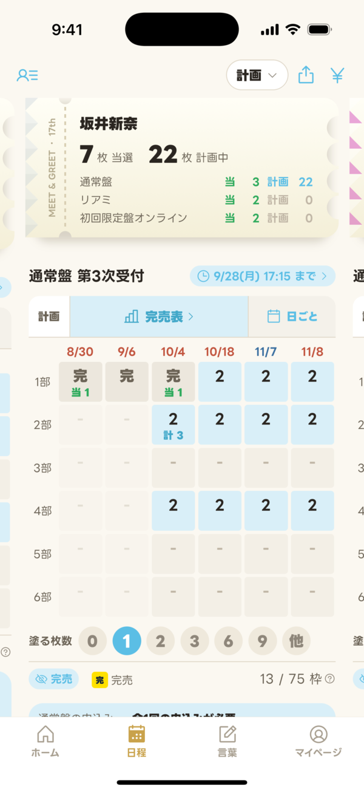
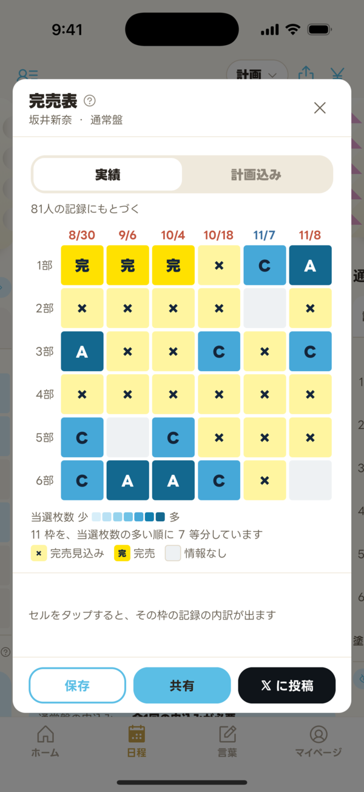
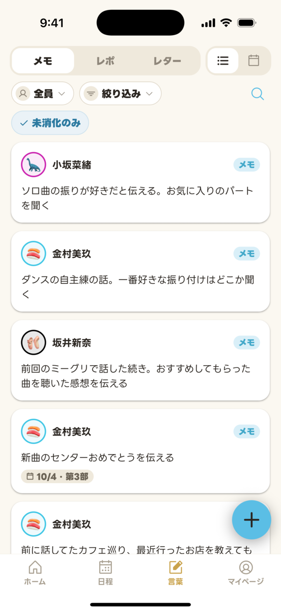
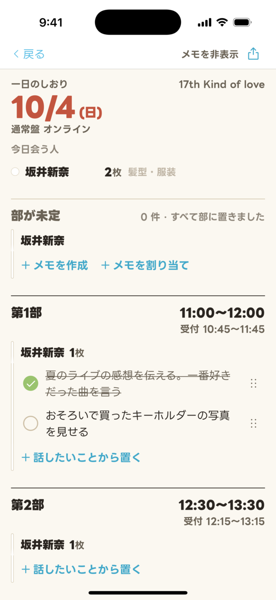
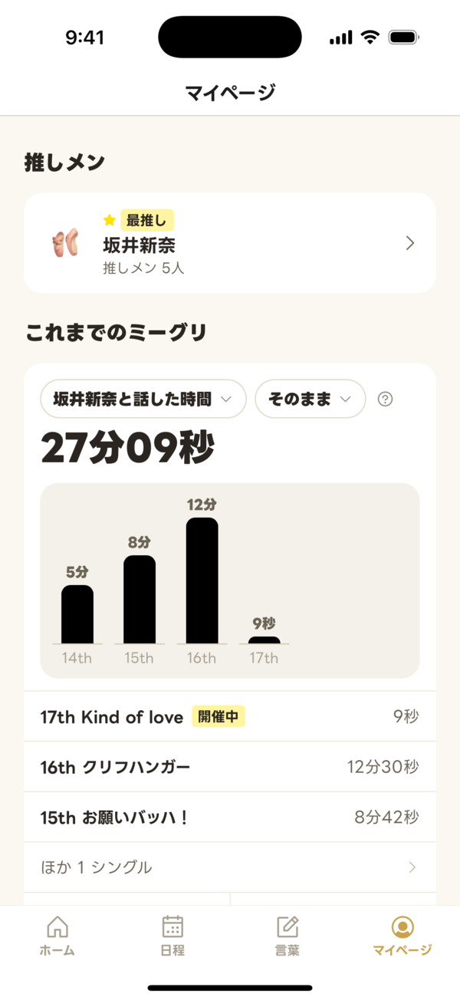

# ミトレル (Meetrail) — 開発に参加してくれる人を探しています

日向坂46 のミート&グリート (ミーグリ) の **参加記録と購買計画**を管理するスマホアプリ「ミトレル」を作っています。
2026 年 8 月に iOS 版をリリースし、いま動いているアプリです。

- App Store: https://apps.apple.com/jp/app/id6763825934
- 使い方・よくある質問: https://sekai-nina.github.io/meetrail-site/

**ソースコードは非公開です。** このリポジトリには、参加を検討してくれる人が
「自分に何ができそうか」を判断するための情報だけを置いています。

---

## どんなアプリか

ミーグリは「どの日程の第何部を、何枚、どの受付で申し込むか」を毎シングル考える必要があり、
当落が出るたびに手元の表を書き換えることになります。ミトレルはこれを 1 つのアプリに収めました。

- **計画 (日程タブ)** — 日 × 部のマトリックスを塗って申込計画を立て、上限や予算と突き合わせる。
  申込みの回ごとの割り振り、初回限定盤の応募券シリアルの読み取りと入力補助 (iOS) まで
- **記録** — 当落・参加・支払いの記録。forTUNE のページを Safari から共有して取り込むこともできる
- **言葉 (言葉タブ)** — 話したいことのメモ、当日の「一日のしおり」、参加後のレポ、公式メッセージアプリに送るレター
- **売れ行きの可視化** — 自分の記録だけでなく、他ユーザーの記録を集計して各日程の売れ行きを推定する

最後の 1 つが中核です。1 人だと自分の申込結果しか分かりませんが、記録が集まると
「どの日程が埋まりやすいか」が見えるようになります。

| ホーム | 日程 | 完売表 |
|---|---|---|
|  |  |  |

| 言葉 | 一日のしおり | これまでのミーグリ |
|---|---|---|
|  |  |  |

---

## 規模

判断材料として、素の数字を出します (2026 年 9 月時点)。

| | |
|---|---|
| TypeScript | 約 210,000 行 |
| 画面 | 69 |
| コンポーネント | 195 |
| DB マイグレーション | 138 |
| ユニットテスト | 363 ファイル |
| E2E シナリオ | 91 feature ファイル |
| DB テスト (pgTAP) | 69 ファイル |
| 開いている Issue | 254 |
| 直近 3 か月にマージした PR | 約 340 |
| 開発しているのは | 3 人 |

**最後の 2 行が、この募集の理由です。** やりたいことに対して手が足りていません。

---

## 技術スタック

| カテゴリ | 使っているもの |
|---|---|
| フレームワーク | React Native + Expo (TypeScript strict) |
| ルーティング | Expo Router (ファイルベース) |
| バックエンド | Supabase (Auth / Postgres / Row Level Security) |
| 状態管理 | Zustand + TanStack Query |
| スタイリング | NativeWind (Tailwind) |
| テスト | Jest / Playwright + Cucumber (Gherkin) / pgTAP |
| CI・配信 | GitHub Actions + EAS Build / EAS Update (OTA) |
| エラー監視 | Sentry |

---

## 開発の進め方

**Claude Code (AI ペアプログラミング) を前提にした開発**をしています。
ここが一番好みが分かれるところなので、先に書いておきます。

- 開発ルール・ドメイン用語・UI 規約を **ドキュメントとして書き、人間と AI が同じものを読む**。
  「なんとなくの暗黙知」を残さず、決めたことは必ず文章にする
- 1 つの作業につき 1 つの git worktree。`feature/*` → `dev` → `main` → タグで本番
- PR は複数の観点 (バグ / 設計 / パフォーマンス / UI 一貫性 / セキュリティ / テスト) で
  レビューを通してからマージする
- lint と型チェックが通るまで完了としない
- **やりとりもコードコメントも日本語**

AI に書かせて終わりではありません。**「なぜその判断にしたか」を残すこと**に重心があります。
規約ファイルには「この方法を採らなかった理由」が実測値つきで書かれていて、
それが次の判断の土台になっています。

---

## 品質についての考え方

規約の本文は非公開ですが、考え方は次のとおりです。

- **UI は基底コンポーネント経由で書く。** 色やサイズを個別に上書きしない。
  どうしても基底で表現できないものは、「**例外表に理由を書いてから**」直書きする
- **色は意味で決める。** 「この意味にはこの色」の対応表があり、感覚で色を足さない
- **E2E は Gherkin でシナリオを書く。** 「何を確かめているか」が日本語で読める状態を保つ
- **DB の不変条件は pgTAP で検証する。** トリガーや RPC を変えたらテストも書く
- **テストが緑になっただけで終わりにしない。** わざと壊して、テストが赤くなることを確かめる

---

## いま足りていないところ

役割別に、正直に書きます。

### 実装 (React Native / TypeScript)

- **大きくなりすぎた画面の分解** — 育つうちに 1 ファイル数百行になった画面が複数あり、
  ロジックを hook や純関数に切り出したい
- **重複の共通化** — 同じ見た目のパーツが複数箇所に散っていて、共通化の順番待ちになっている
- **データ取得まわりの整理** — 1 回の操作でキャッシュ更新が広範囲に飛ぶ箇所があり、無駄が多い
- **テストの穴** — hook の状態遷移をテストする土台がまだ無く、入れたい

### デザイン / UI

- **デザイン刷新の適用漏れ** — 新しいトーンに合わせきれていない画面が残っている
- **画面サイズ差の検証** — 小さい端末や Android での崩れを、まとめて確認できていない
- **細部の詰め** — 押しやすさ、色のコントラスト、文言の統一

### インフラ / バックエンド

- **配信パイプラインの復旧** — TestFlight 向けの自動ビルドが止まっている
- **CI の拡充** — DB テストが CI で回っていない
- **エラー監視の精度** — 監視に流れてくる情報が粗く、原因までたどり着きにくい

「自分ならここが得意」が 1 つでもあれば、それだけで十分です。全部できる必要はありません。

---

## 参加の流れ

1. 下の連絡先から声をかけてください。「**何ができるか**」「**どのくらい時間を出せそうか**」が
   分かると話が早いです (GitHub アカウントや過去の制作物があれば、それも)
2. お互いに合いそうか話します。アプリの中身や、いま困っていることは、ここで具体的にお見せします
3. 参加にあたっての同意 (下記) を確認します
4. 非公開リポジトリに招待します。開発環境のセットアップ手順は用意してあります
5. 小さめの Issue から始めてもらいます

途中で抜けても構いません。「1 個だけ直して終わり」でも歓迎です。

---

## 参加にあたって

先に伝えておきます。

- **無償の有志プロジェクトです。** 報酬はありません。推し活の延長として一緒に作ってくれる人を探しています
- **オープンソースではありません。** ミトレルは独自ライセンス (プロプライエタリ) です。
  他のグループ向けに作り替えて運用することを明示的に禁止しています
- **貢献物の扱い** — 提供してもらったコードやドキュメントは、プロジェクトの一部として
  自由に利用・改変・再配布できるものとして扱わせてもらいます (ライセンス第 6 条)
- **非公開の情報を外に出さないこと** — 招待後に見えるようになる仕様やデータについて、
  外部への持ち出しはご遠慮ください

---

## 連絡先

- メール: sekainina.project@gmail.com
- 問い合わせフォーム: https://sekai-nina.com/contact/
- X (旧 Twitter): [@meetrail_app](https://x.com/meetrail_app) (アプリの告知) / [@sekainina314](https://x.com/sekainina314) — DM でも構いません

---

## このリポジトリについて

文章・画像は世界新奈プロジェクトに帰属します。詳しくは [LICENSE](LICENSE) を参照してください。
Issue と Pull Request は受け付けていません (上記の連絡先へお願いします)。
